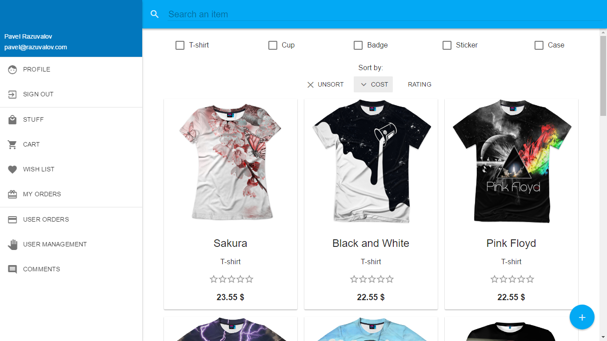
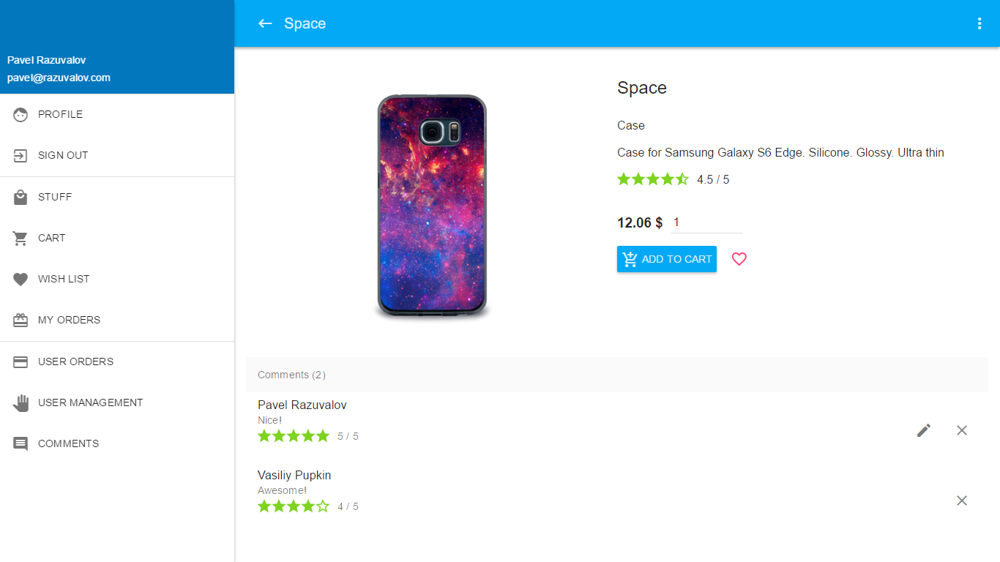

# Stuff management app

This app is designed for selling stuff and managing orders.




## Installation

You need Node.js at least LTS version and MongoDB

```sh
npm install
```

## Usage

```sh
npm start
```

## Release History

* 0.1.0
    * The first proper release
* 0.0.1
    * Work in progress

## Author

Pavel Razuvalov – [@Facebook](https://facebook.com/BrainWubber) – pavel@razuvalov.com